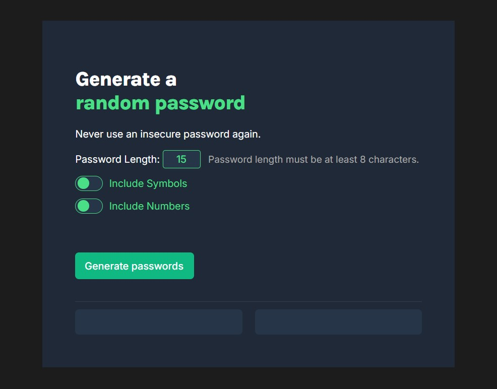

# Password Generator

A simple, stylish password generator built with HTML, CSS, and JavaScript.  
It allows you to generate strong random passwords with customizable options.

## Screenshot



---

## Features

- **Customizable Length:** Set password length (minimum 8 characters).
- **Include Symbols:** Toggle to include/exclude symbols.
- **Include Numbers:** Toggle to include/exclude numbers.
- **Copy to Clipboard:** Click a password to copy it instantly.
- **Responsive UI:** Clean and modern design.

## Usage

1. **Set Password Length:**  
   Enter your desired password length (minimum 8).

2. **Toggle Options:**  
   Use the switches to include/exclude symbols and numbers.

3. **Generate Passwords:**  
   Click the **Generate passwords** button to create two random passwords.

4. **Copy Password:**  
   Click on any generated password to copy it to your clipboard.

## Getting Started

1. Clone or download this repository.
2. Open `index.html` in your browser.

## Project Structure

```
/Password-generator
│
├── index.html      # Main HTML file
├── index.css       # Stylesheet
└── index.js        # JavaScript logic
```

## Customization

- **Password Rules:**  
  You can adjust the character sets in `index.js` to change which characters are used.

- **Styling:**  
  Modify `index.css` to change the look and feel.

## License

This project is open source
